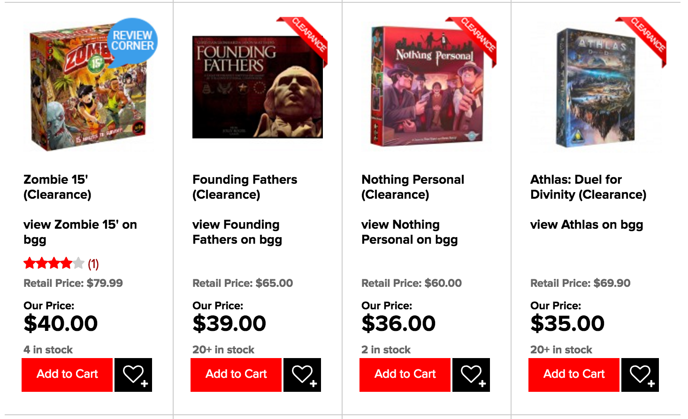

# GGBGG

An ultra-cargo-culted and only-barely-working Chrome extension that is meant to
add links to boardgamegeek to game listings on miniaturemarket.

Currently it just naively drops a search link with a substring of the
product name to every listing.

Ideally, I'd love to use the BGG API to do things like: do actual searches for
the game and return a direct link, maybe inline things like ratings, player
count, play time, etc.

I hate browsing the Clearance section and seeing a bunch of games I've never
heard of and being like "okay, what's BGG think about this?" and having to open
another tab and searching and clicking and all that garbage.

# Usage

## From source

- Clone this repo.
- Drag the folder onto the browser on the `chrome://extensions/` page and install
- Browse to a miniaturemarket.com listing page.
- Notice all the `view (.*) on bgg` links.
